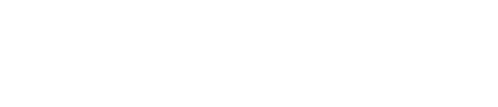
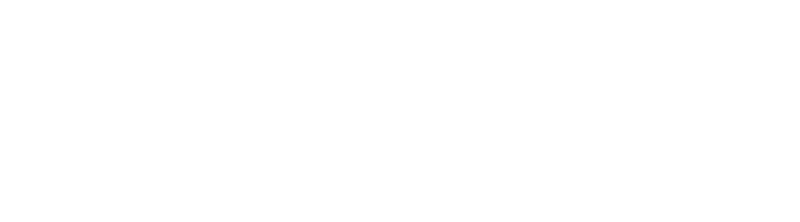

# Instrumentation Object Size

Examine the size of objects at runtime, to analyze memory impact of data
structures.

## Collections

### ArrayMap

Size: 560

### HashMap

Size: 704

### LinkedHashMap

Size: 744

### mapOf

Size: 712

### object

Size: 256

### SimpleArrayMap

Size: 552

### TreeMap

Size: 656

